# Atlas v1 Sanitized Build Evidence

All images in this gallery were reviewed and sanitized for public use. Labels, serial numbers, service codes, usernames, hostnames, addresses, hardware addresses, machine identifiers, UUIDs, and reflections were removed or obscured where present.

## Physical Build and Restoration

| Evidence | Image |
|---|---|
| Underside with service cover installed | 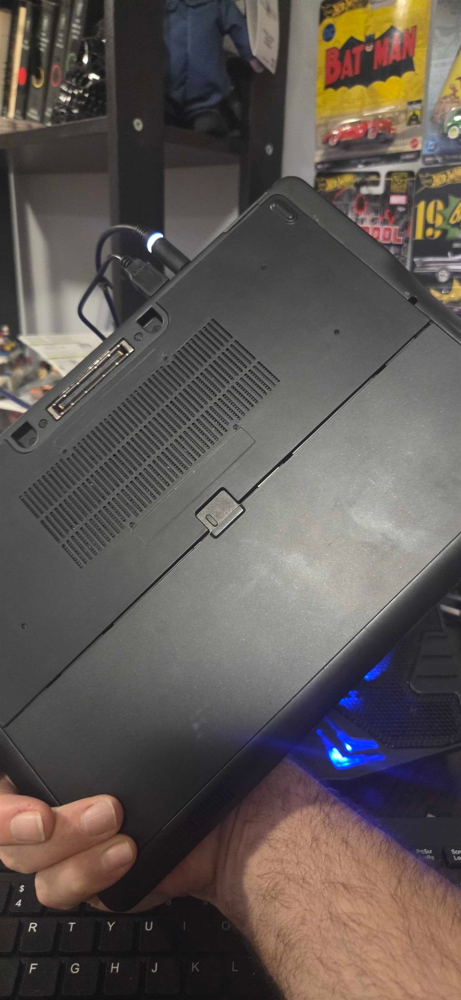 |
| Internal layout before maintenance | 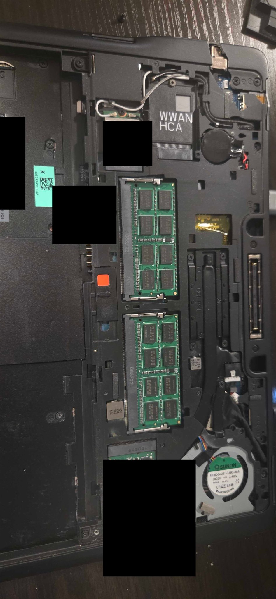 |
| Evaluated 1 TB SSD compared with the installed form factor | 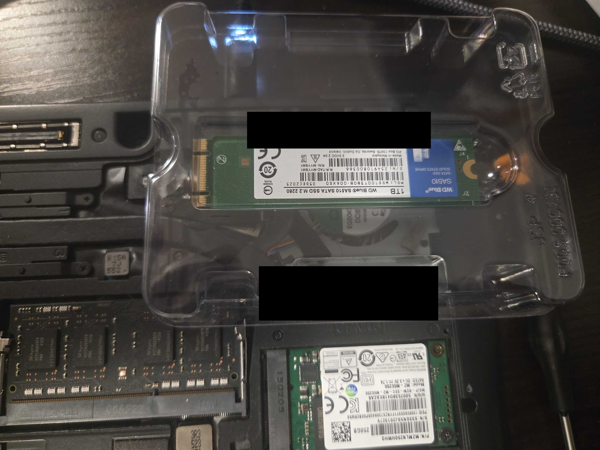 |
| Original SSD and memory area | 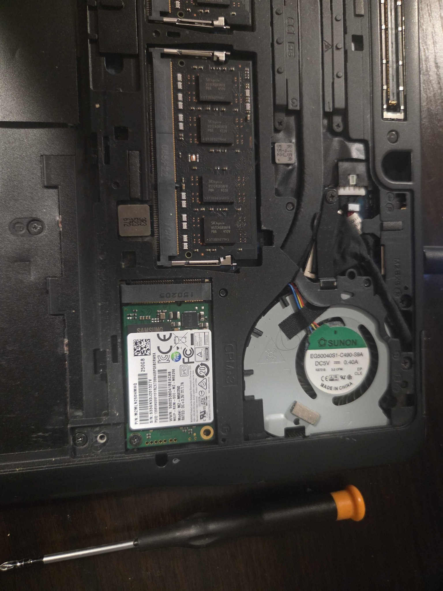 |
| Original SSD close-up with identifiers removed | 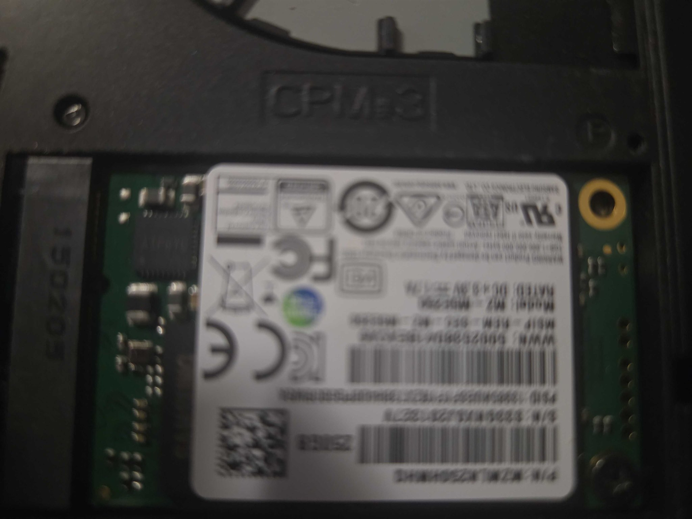 |
| Internal layout after maintenance | 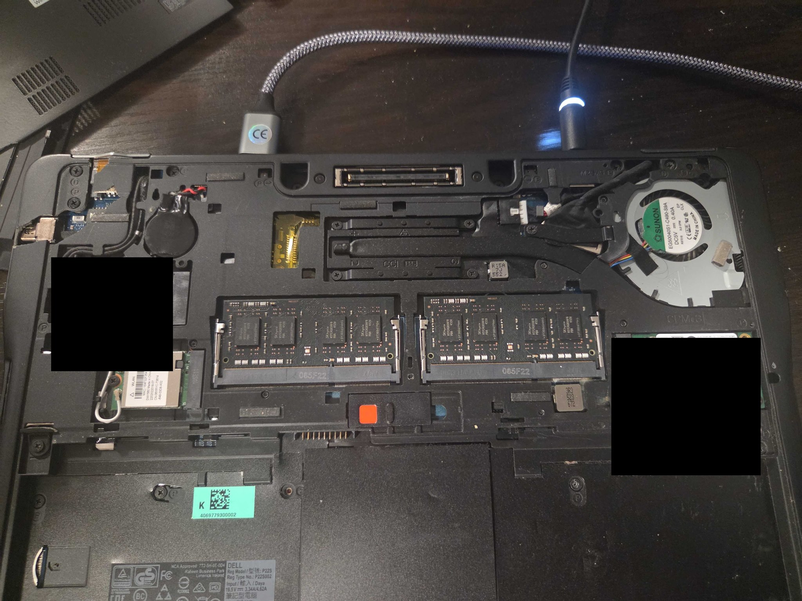 |
| Completed Atlas setup with HP keyboard and component packaging | 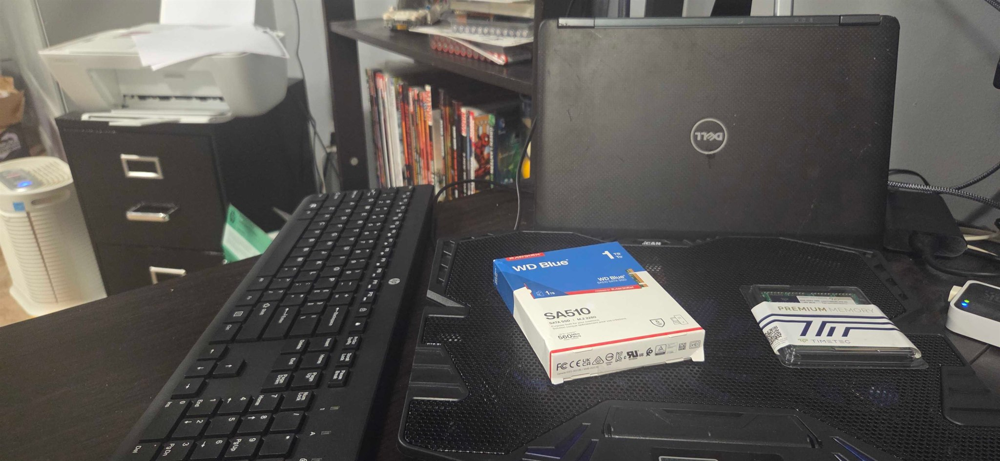 |
| Historical local-console validation photo |  |
| Second historical local-console validation photo | 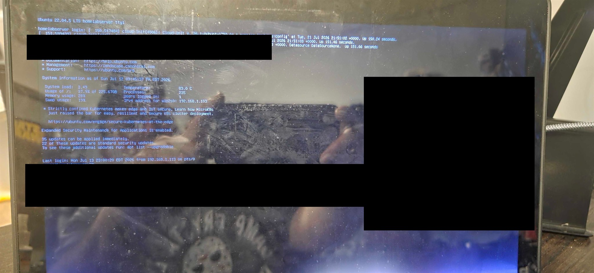 |
| Top cover condition | 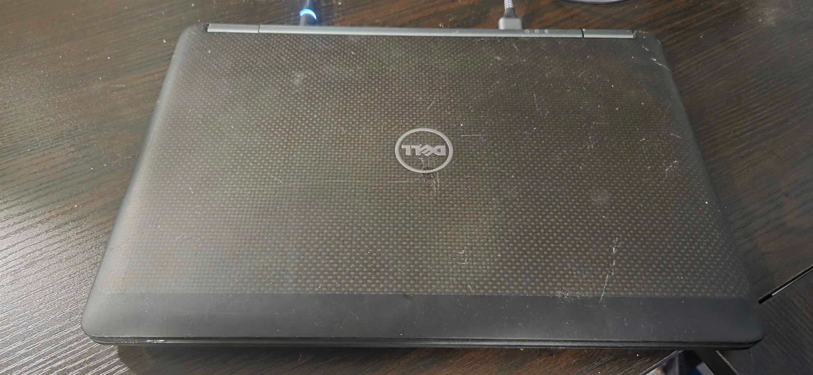 |
| Installed keyboard and palm-rest area | 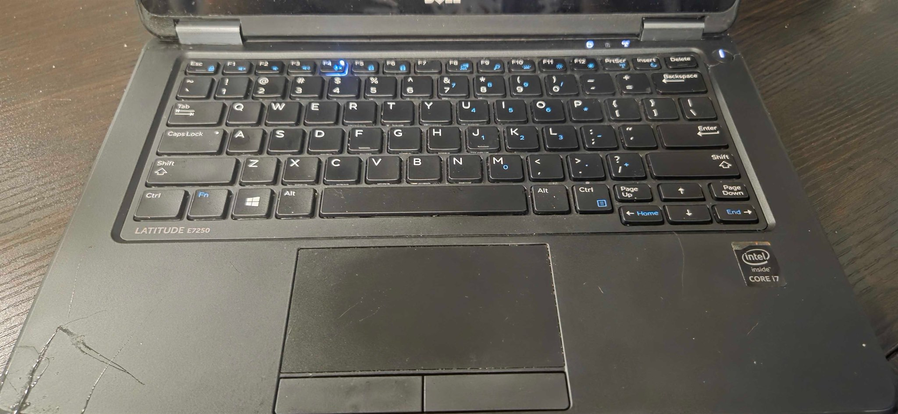 |
| Damaged built-in Ethernet port | 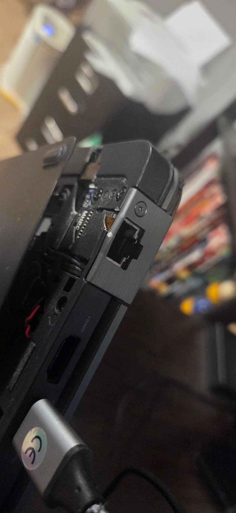 |
| Underside condition with service labels obscured | 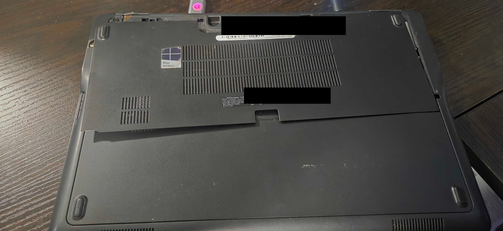 |
| Damaged chassis corner | 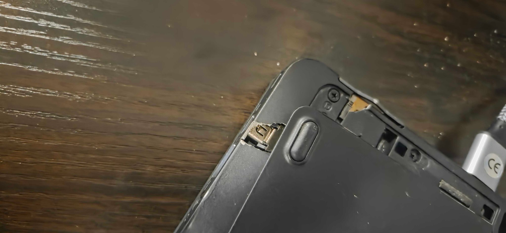 |
| Power and cooling connections | 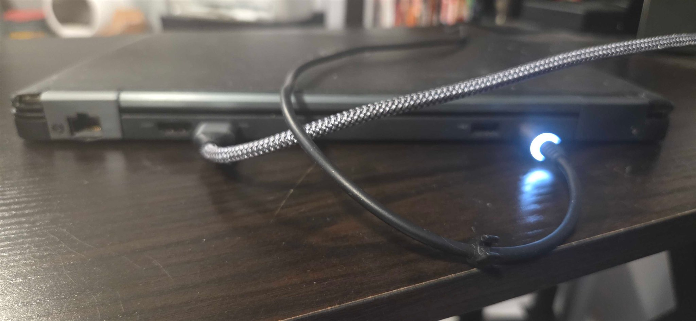 |

## Historical Pre-Upgrade Audit Screenshots

These screenshots show the earlier Ubuntu 22.04 / 8 GB baseline. They are not the current Atlas v1 “after” state.

- [Host and CPU baseline](../../screenshots/atlas-v1/16-host-and-cpu-audit.png)
- [Memory and uptime baseline](../../screenshots/atlas-v1/17-memory-and-uptime-audit.png)
- [PCI and USB baseline](../../screenshots/atlas-v1/18-pci-and-usb-audit.png)
- [Routing baseline](../../screenshots/atlas-v1/19-routing-audit.png)
- [Storage baseline](../../screenshots/atlas-v1/20-storage-audit.png)
- [Network-interface baseline](../../screenshots/atlas-v1/21-network-interface-audit.png)
- [Failed-services baseline](../../screenshots/atlas-v1/22-failed-services-audit.png)

For the finished system state, use the [sanitized post-upgrade audit](atlas-v1-after-audit.md).
